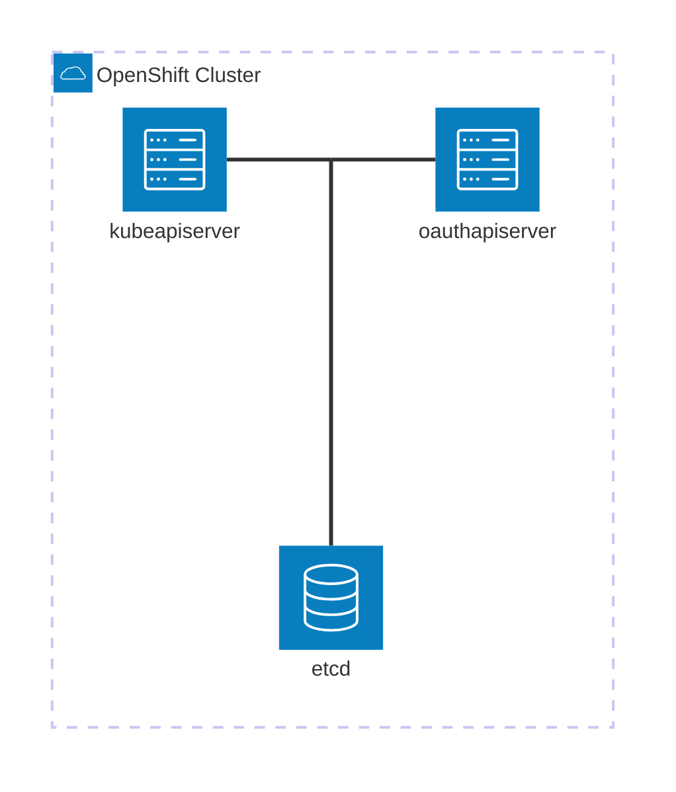

# Architecture

## Overview

The OpenShift oauth-apiserver is an [aggregated API server](https://kubernetes.io/docs/concepts/extend-kubernetes/api-extension/apiserver-aggregation/) and [webhook token authenticator](https://kubernetes.io/docs/reference/access-authn-authz/authentication/#webhook-token-authentication) that extends the capabilities of the Kubernetes API server.

From an architecture perspective, this essentially means that the oauth-apiserver is an HTTP server that
implements its API interfaces in the same way that the Kubernetes API server does.

We use the [Kubernetes API Aggregation Layer](https://kubernetes.io/docs/concepts/extend-kubernetes/api-extension/apiserver-aggregation/) to register these new APIs via the [`APIService` resource](https://kubernetes.io/docs/reference/kubernetes-api/cluster-resources/api-service-v1/).

## High-level Diagram

When the kube-apiserver receives a request for a resource served by the oauth-apiserver, it acts a proxy and will forward the request
to the oauth-apiserver.

Both the kube-apiserver and the oauth-apiserver share the same etcd instances for storage.

For authentication requests that are forwarded to the oauth-apiserver, the kube-apiserver uses the [`TokenReview` API](https://kubernetes.io/docs/reference/kubernetes-api/definitions/token-review-v1-authentication/) to request validation of a provided token.
If the token is valid, the oauth-apiserver responds with user metadata by setting the `.status` field in the `TokenReview` and returns it in it's response.

A more detailed diagram of how the oauth-apiserver fits into the overall architecture of the OpenShift Control Plane can be found at https://miro.com/app/board/uXjVLrZngX4=/?moveToWidget=3458764614022295631&cot=10

## Dependencies

The key dependencies this project has are:
- [openshift/kubernetes-apiserver](https://github.com/openshift/kubernetes-apiserver) - our fork of the Kubernetes `apiserver` library that is used for writing API servers.
- [openshift/api](https://github.com/openshift/api) - Mono-repo of core OpenShift API definitions.

## Trade-Offs / Decisions

### Bootstrap User Uses ClusterAdminGroup Instead of SystemPrivilegedGroup
The bootstrap authenticator assigns `ClusterAdminGroup` rather than `SystemPrivilegedGroup` because the latter cannot be properly scoped. API aggregation with delegated authorization (via `WithAlwaysAllowGroups`) makes `SystemPrivilegedGroup` impossible to control. This makes the bootstrap user susceptible to RBAC authorizer failures, but this is considered an acceptable trade-off because scopes must always be evaluated before RBAC for them to work at all. Alternative approaches were considered and rejected: a custom authorizer tied to a secret-derived extra value would require sharing `BootstrapUserDataGetter` logic between the kube API server and osin, breaking the current encapsulation where only the `BootstrapUser` constant is shared.
- `pkg/tokenvalidation/bootstrapauthenticator.go:98-111`

### Hardcoded TokenReview Authorization to Avoid Cyclical Checks
The oauth-apiserver provides an authentication webhook. To avoid cyclical authorization checks when the kube-apiserver calls back to the oauth-apiserver for token validation, the expected user is hardcoded with a tokenreview permission via `NewHardCodedTokenReviewAuthorizer()`. Since this rule could never logically be removed in an OpenShift cluster, this approach is considered acceptable over a dynamic authorization check.
- `pkg/cmd/oauth-apiserver/cmd.go:168-174`

### Etcd Storage Prefixes for Backward Compatibility
The etcd storage prefix (`openshift.io`) and per-resource storage prefixes (e.g., `oauth/accesstokens`, `useridentities`) match historical values used by earlier versions of OpenShift so that resources migrate cleanly. These values cannot change without a data migration.
- `pkg/cmd/oauth-apiserver/cmd.go:35-36`
- `pkg/cmd/oauth-apiserver/cmd.go:201-210`

### Skip Explicit ApplyWithStorageFactoryTo to Prevent Double Health Check Registration
The storage factory setup deliberately avoids calling `ApplyWithStorageFactoryTo` explicitly because `ApplyTo` was already called, which set up etcd health endpoints. Calling it again would cause double registration of storage-related health checks.
- `pkg/cmd/oauth-apiserver/cmd.go:176-189`

### Non-Root Apiserver Must Skip OpenAPI Installation
The oauth-apiserver sets `SkipOpenAPIInstallation = true` because non-root apiservers must not install the default OpenAPI handler. OpenAPI is handled by the OpenAPI aggregator (both v2 and v3) at the root level.
- `pkg/cmd/oauth-apiserver/cmd.go:159-162`

### External Claims: Partial Evaluation Preferred Over Hard Failure
When fetching claims from sources external to the JWT, errors are logged but not returned. Partial evaluation of external claim sources is preferred over failing entirely so that authentication is not wholly dependent on the availability of external sources. Authentication may be in a degraded state if external sources are unavailable, but it will not be blocked.
- `pkg/externaloidc/oidc/externalclaims/resolver/resolver.go:196-205`

### External Claims: 500ms Per-Request Timeout
Each request to an external claims source uses a 500ms timeout. This allows up to 10 sequential external source requests before reaching 5 seconds, which is half the default Kubernetes API server timeout (10s) for webhook authenticator requests. This leaves at least 5 seconds for the rest of the claim mapping logic to execute.
- `pkg/externaloidc/oidc/externalclaims/resolver/resolver.go:54-61`

### External Claims: Intentional Overwriting of Existing Token Claims
When external claims are merged into the token's claim map, existing claims with the same key are intentionally overwritten. While this has tradeoffs, the expectation is that end-users will primarily fetch claims not already present in their tokens. There are valid use cases where admins want to intentionally override claims, so this behavior is documented and admins can use sourcing conditions as a guard.
- `pkg/externaloidc/oidc/externalclaims/resolver/resolver.go:262-272`
- `pkg/externaloidc/apis/authentication/types.go:371-376`

### External Claims: No Response Size Limit (Pending Performance Data)
The response body from external claims sources is read without a size limit (`io.ReadAll` rather than `io.LimitReader`). This is a deliberate deferral: without comprehensive performance testing, there is no data-backed foundation for a reasonable maximum response size. Once testing provides that data, the implementation should move to `io.LimitReader`.
- `pkg/externaloidc/oidc/externalclaims/resolver/resolver.go:347-354`

### External Claims: CEL Expressions Use `any` Return Type
CEL expressions for external source URLs return `any` because at compile time the types of claims in the token are unknown. The return value is explicitly validated after expression evaluation at runtime instead.
- `pkg/externaloidc/cel/accessors.go:52-58`

### External Claims: 256-Character Claim Name Limit
Externally sourced claim names are capped at 256 characters to align with general best practices for token claim names. While token claims have no formally enforced limit, claims are included in request headers where short names are standard practice. 256 characters is considered sufficiently long for any reasonably named claim.
- `pkg/externaloidc/apis/authentication/validation/validation.go:260-266`

### Upstream Divergence: JWT Configuration is Required
Unlike upstream Kubernetes, the OpenShift implementation requires at least one JWT authenticator to be specified in the authentication configuration. This diverges from upstream because external OIDC is an opt-in feature and it does not make sense to allow users to configure it without specifying any authentication configuration.
- `pkg/externaloidc/apis/authentication/validation/validation_test.go:35-39`

### Upstream Divergence: Disallowed Issuers Not Yet Implemented
The OpenShift implementation does not yet support configuring disallowed issuers, which upstream uses to prevent configuring an authenticator for things like the service account issuer. This is a known gap intended to be addressed in the future.
- `pkg/externaloidc/apis/authentication/validation/validation_test.go:260-263`

### Identity and ClientAuthorization Names Are Immutable Formats
The computed name formats for identities (`provider:identity`) and OAuth client authorizations (`userName:clientName`) cannot change because they must match resources already persisted in etcd. Changing these formats would cause unpredictable behavior for existing client authorizations and break identity lookups.
- `pkg/user/apiserver/registry/identity/strategy.go:49-52`
- `pkg/oauth/apiserver/registry/oauthclientauthorization/strategy.go:130-133`

### User-Identity Mapping Operations Tolerate Partial Cleanup Failures
When updating or deleting user-identity mappings, the primary operation (updating the identity's user reference) is performed first. If subsequent cleanup operations fail (removing the identity reference from the old user, or removing the user reference from the identity), errors are logged but execution continues. This is because the cleanup operations are no longer re-entrant at that point — retrying would not produce the correct result, and the critical mapping state has already been updated.
- `pkg/user/apiserver/registry/useridentitymapping/rest.go:175-180`
- `pkg/user/apiserver/registry/useridentitymapping/rest.go:203-209`

### Timeout Validator: Flush Overlap Margin
The token timeout validator adds a 10-second safety margin to its ticker interval so that consecutive flush cycles tend to overlap slightly rather than have gaps, preventing windows where expired tokens could be missed.
- `pkg/tokenvalidation/timeoutvalidator.go:197-200`

### Timeout Validator: Non-Blocking Token Updates via Goroutine
After a positive timeout check, the token update is scheduled via a goroutine to avoid blocking the authentication request path.
- `pkg/tokenvalidation/timeoutvalidator.go:100-102`

### TokenReview Uses Internal Type Conversion to Avoid OpenAPI Errors
The TokenReview REST handler converts from the v1 external type to the internal type before delegating to the wrapped handler. This avoids "cannot find model definition" errors that occur when internal types are used in `New()`.
- `pkg/oauth/apiserver/registry/tokenreviews/etcd.go:58-63`

### Test Server Returns Tear-Down Function Instead of Stop Channel
The test server returns a tear-down function rather than a stop channel because Go testing's call to `os.Exit` does not give a stop channel goroutine enough time to remove temporary files, leading to leaked temporary files.
- `pkg/cmd/oauth-apiserver/testing/testserver.go:45-48`

### Copied Constants to Avoid Transitive Dependency on Kube
Scope-related string constants (`UserIndicator`, `UserInfo`, `UserAccessCheck`) are copied from the apiserver-library-go repo rather than imported, to avoid a transitive dependency on kube for string constants.
- `pkg/oauth/apiserver/registry/oauthclientauthorization/strategy_test.go:12`

### Field Selector Conversion Per Group Version
Field selector conversions are implemented as separate functions per group version (rather than a shared function) because field selector support can vary by the version under which a resource is exposed.
- `pkg/oauth/apis/oauth/v1/conversion.go:25-26`
- `pkg/user/apis/user/v1/conversion.go:15-16`
